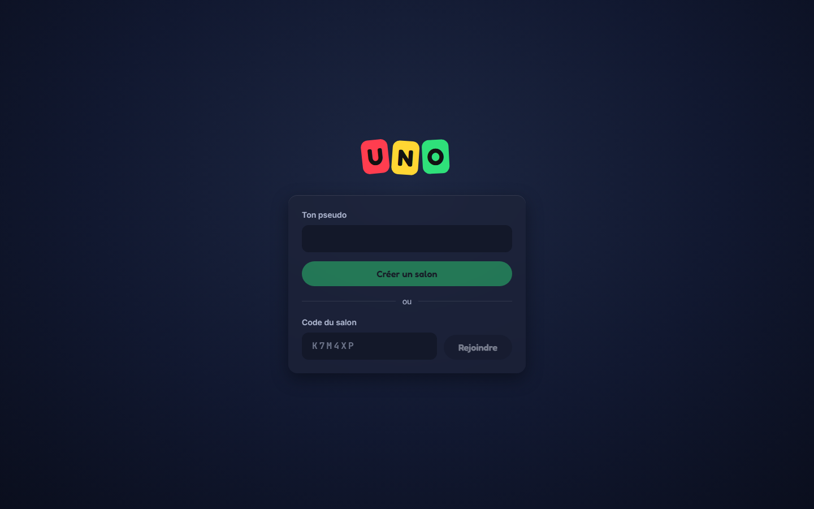
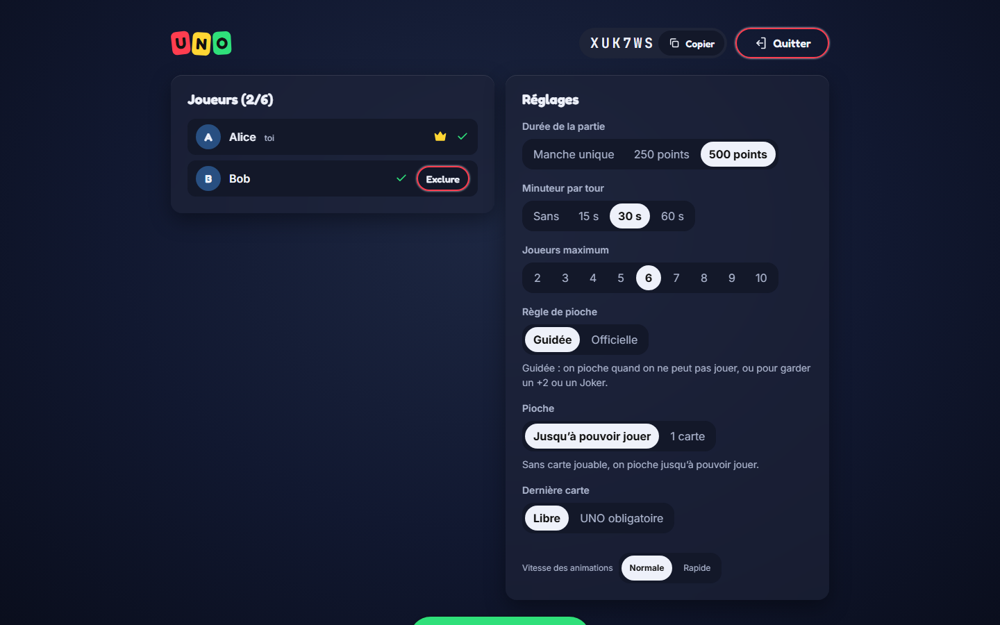
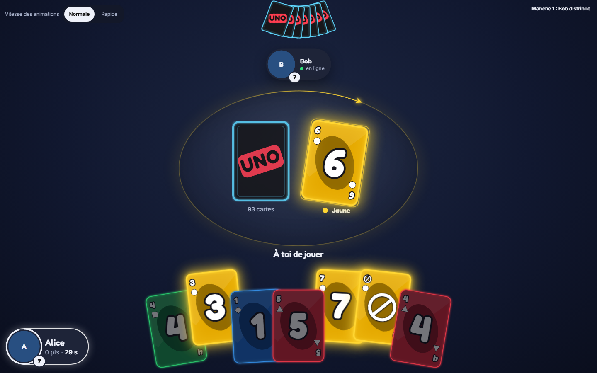

# UNO Néon

Jeu de UNO multijoueur en ligne, jouable dans le navigateur sans installation ni compte : on choisit un pseudo, on
crée un salon, on partage un code de 6 caractères et on joue de 2 à 10 joueurs.

> Projet personnel non commercial, non affilié à Mattel. UNO est une marque de Mattel.

| Accueil | Salon |
|---|---|
|  |  |



- **Serveur autoritaire** en C++23 (WebSocket, uWebSockets) : il décide de tout, le navigateur n'envoie que des
  intentions, et ne reçoit jamais les cartes des autres.
- **Client** Angular 22 (standalone, zoneless, signals).
- **Protocole** JSON sur `/ws`, décrit par des schémas JSON Schema.
- Règles officielles (Joker +4 contestable, contre-UNO) et quelques règles maison réglables dans le salon.

## Lancer le projet

Prérequis (Windows 10/11, Build Tools Visual Studio, CMake, Ninja, vcpkg, Node) : voir [docs/SETUP.md](docs/SETUP.md).

```powershell
# Depuis un terminal où l'environnement MSVC x64 est chargé (`dev64`, voir docs/SETUP.md)
cd server
cmake --preset dev
cmake --build --preset dev
cd ..
./scripts/dev.ps1        # lance le serveur (port 9001) et le client (http://localhost:4200)
```

Ouvrir deux onglets sur <http://localhost:4200> : un joueur crée un salon, l'autre le rejoint par le code ou le lien.

Les tests et le lint (serveur, client, E2E) sont listés dans la section « Commandes » de [CLAUDE.md](CLAUDE.md).

## Arborescence

| Dossier | Contenu |
|---|---|
| `protocol/` | schémas du protocole (source de vérité) et exemples de messages |
| `server/` | serveur C++23 : `uno_core` (règles, sans E/S), `uno_app` (salons, sessions), `uno_net` (réseau), `uno_server` |
| `client/` | application Angular |
| `e2e/` | tests de bout en bout Playwright |
| `deploy/` | Dockerfile, Caddy, docker-compose (à venir, phase 6) |
| `docs/` | spécification, avancement, décisions d'architecture (`adr/`) |

## Documentation

- [Mode d'emploi pour l'hôte](docs/MODE-EMPLOI.md) : jouer avec des amis à distance, pas à pas.
- [Spécification](docs/SPEC.md) : le quoi et le pourquoi de chaque choix.
- [Avancement](docs/PROGRESS.md) : phases, étapes, journal.
- [Décisions d'architecture](docs/adr/) : une ADR par choix structurant.
- [Sécurité](SECURITY.md) : comment signaler une faille.

## Contribuer

Projet personnel : les contributions externes ne sont pas attendues. Pour signaler une faille de sécurité, voir
[SECURITY.md](SECURITY.md).

## Licence

Tous droits réservés : pas de licence open source pour l'instant. Le code est public pour être lu, pas pour être
réutilisé.

## Crédits

Polices **Fredoka**, **Inter** et **JetBrains Mono**, sous licence [SIL Open Font License 1.1](https://openfontlicense.org),
installées via [Fontsource](https://fontsource.org) (`@fontsource-variable/fredoka`, `@fontsource-variable/inter`,
`@fontsource/jetbrains-mono`). Les cartes, le logo et les icônes sont dessinés pour le projet.
