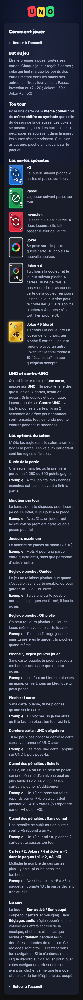
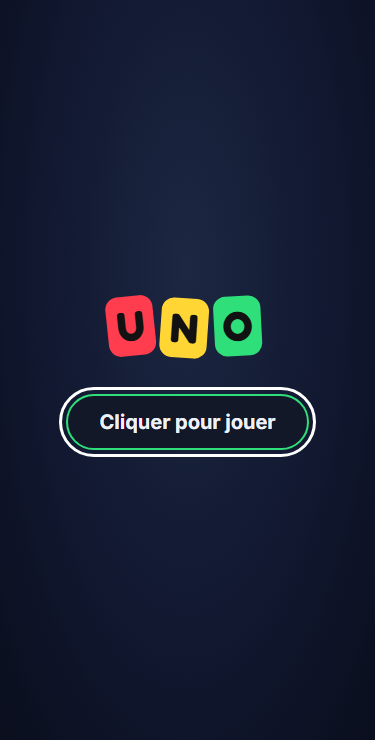
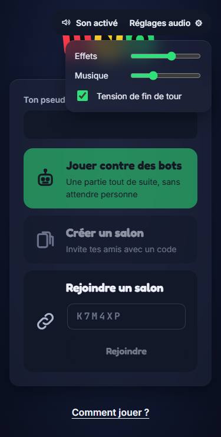
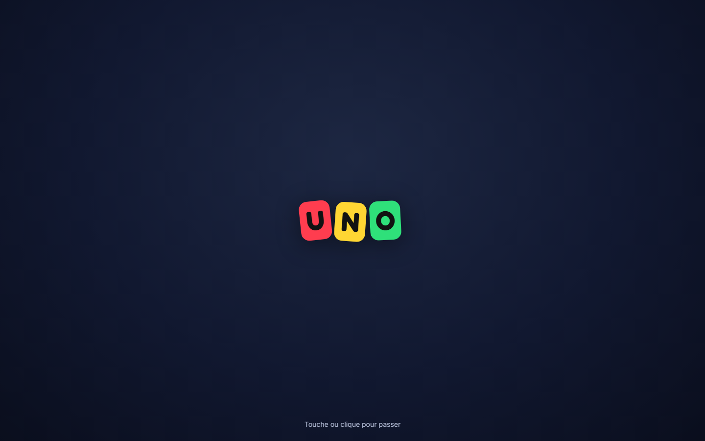

# Mode d'emploi — organiser une soirée UNO Néon (pour l'hôte)

Ce guide est pour **toi, l'hôte** : celui qui lance le jeu depuis son PC Windows et envoie un lien à ses amis.
Tes amis, eux, n'ont **rien à installer** : ils ouvrent le lien dans leur navigateur (téléphone ou ordinateur).

> Les règles du jeu sont expliquées dans le jeu lui-même, page **« Comment jouer »** (lien sur l'accueil) :
>
> 

## Comment ça marche, en une phrase

Ton PC fait tourner le jeu. Un **tunnel** (un petit programme de Cloudflare) lui donne une adresse sur Internet
(`https://….trycloudflare.com`) sans que tu aies à toucher à ta box. Tes amis ouvrent cette adresse : c'est tout.

```
Tes amis  ──▶  adresse https://….trycloudflare.com  ──▶  le tunnel  ──▶  ton PC (le jeu)
```

Le jeu n'est joignable **que** par cette adresse. Elle change à chaque soirée.

## 1. Installation (une seule fois)

Il te faut déjà : Windows 10 ou 11, les Build Tools de Visual Studio et Node.js (voir `docs/SETUP.md`).
Il manque seulement deux petits programmes, installés par `winget` (déjà présent dans Windows) :

1. Ouvre **PowerShell** dans le dossier du projet (`C:\dev\uno-neon`).
2. Tape :

   ```powershell
   ./scripts/setup-online.ps1 -Install
   ```

3. Le script vérifie tout et écrit une ligne verte `[ok]` par outil. Si une ligne rouge `[manque]` apparaît, il dit quoi faire.

Les deux programmes installés :

| Programme | Rôle | Commande manuelle |
|---|---|---|
| **Caddy** | sert le jeu, le protège et le compresse | `winget install --id CaddyServer.Caddy --exact` |
| **cloudflared** | crée le tunnel et l'adresse publique | `winget install --id Cloudflare.cloudflared --exact` |

## 2. Lancer une soirée de jeu

1. Ouvre PowerShell dans `C:\dev\uno-neon`.
2. Tape :

   ```powershell
   ./scripts/play-online.ps1
   ```

3. **Patiente.** La première fois, la compilation prend quelques minutes. Les fois suivantes, un peu moins d'une minute
   (plus si tu as changé le code). Tu verras défiler : *Démarrage de Caddy… Ouverture du tunnel Cloudflare… Démarrage du serveur…*
4. Quand tout est prêt, un grand cadre apparaît :

   ```
     ==========================================================
      Le jeu est en ligne. Envoie ce lien à tes amis :

        https://exemple-de-lien.trycloudflare.com

      (copié dans le presse-papiers)
      Ctrl+C pour tout arrêter. Ne ferme pas cette fenêtre,
      et ne mets pas le PC en veille pendant la partie.
     ==========================================================
   ```

   Le lien est **déjà copié** : colle-le (Ctrl+V) dans votre conversation.

Avant de te montrer ce lien, le script a vérifié la sécurité : si quelque chose n'allait pas, il s'arrête et le dit
au lieu de publier.

## 3. Jouer et partager le lien

1. Ouvre le lien toi aussi, dans ton navigateur. La première fois, clique sur **« Cliquer pour jouer »** (c'est ce clic qui
   permet au navigateur de faire du son).

   
2. Choisis un pseudo, puis **« Créer un salon »**. Le lien « Comment jouer ? » en bas de l'accueil explique les règles à tes amis.

   
3. Dans le salon, deux façons d'inviter :
   - copie le **lien du salon** (bouton de copie à côté du code) et envoie-le ;
   - ou donne le **code à 6 lettres** : tes amis ouvrent le lien principal, tapent le code et cliquent sur « Rejoindre ».
4. Règle les options du salon si tu veux (durée de la partie, minuteur, règles maison…).
5. Quand tes amis ont cliqué sur **« Prêt »**, clique sur **« Lancer la partie »**.

Tu peux aussi ajouter des **bots** au salon pour compléter la table.

> Sur ordinateur, c'est pareil en plus large :
>
> 

## 4. Arrêter

Dans la fenêtre PowerShell où tourne le script, appuie sur **Ctrl+C**. Tu verras :

```
Arrêt du serveur, de Caddy et du tunnel...
Tout est arrêté.
```

Le lien ne fonctionne plus. La prochaine fois, tu auras un nouveau lien.

## 5. Ce qu'il ne faut pas faire

- **Ne ferme pas la fenêtre PowerShell** pendant la partie : le jeu s'arrête pour tout le monde. (Si tu la fermes sans
  faire Ctrl+C, Windows arrête quand même les trois programmes : rien ne reste en fond, mais la partie est coupée.)
- **Ne laisse pas le PC se mettre en veille.** Le script l'empêche tant qu'il tourne, mais si tu fermes le capot d'un
  portable, il se met en veille quand même. Branche-le sur le secteur et règle la fermeture du capot sur « Ne rien faire ».
- **Ne lance pas le script deux fois** : le deuxième dira que le port est déjà utilisé.
- **Ne partage pas le lien n'importe où** : toute personne qui l'a peut entrer dans le jeu (pas dans ton PC, seulement dans le jeu).

## 6. Dépannage

| Problème | Ce qu'il faut faire |
|---|---|
| **« Le port 9001 (serveur) est déjà utilisé… »** ou **8080 (Caddy)** | Un autre programme (souvent une ancienne partie ou `npm start` / `dev.ps1`) occupe le port. Le message donne son nom et son numéro : ferme-le (ou `Stop-Process -Id <numéro>`) puis relance. |
| **« Caddy ou cloudflared manque »** | Lance `./scripts/setup-online.ps1 -Install`, puis ferme et rouvre PowerShell. |
| **Le tunnel ne démarre pas** (« Le tunnel n'a pas donné d'adresse après 45 s ») | Vérifie ta connexion Internet, désactive un VPN ou un pare-feu qui bloque les connexions sortantes, puis relance. Les détails sont dans `%TEMP%\uno-neon-online\cloudflared.err.log`. |
| **« … ne répond pas après 90 s »** | L'adresse met parfois une minute à exister. Relance ; si ça persiste, regarde `%TEMP%\uno-neon-online\`. |
| **Un ami dit « le site est introuvable » ou « page blanche »** | Vérifie que la fenêtre du script est toujours ouverte et que le PC n'est pas en veille. Renvoie le lien **exactement** tel qu'affiché (il commence par `https://`). Les liens des soirées précédentes ne marchent plus. |
| **Un ami n'arrive pas à rejoindre (« connexion refusée »)** | Il a peut-être ouvert l'adresse avec une faute, ou un ancien lien. Il doit utiliser le lien de **cette** soirée. Le jeu n'accepte que l'adresse du tunnel en cours. |
| **Pas de son** | Clique d'abord sur « Cliquer pour jouer » (le navigateur refuse le son avant un clic). Vérifie le bouton **« Son activé »** et les volumes dans **« Réglages audio »** : les effets et la musique se règlent séparément. Sur téléphone, vérifie que le mode silencieux est coupé. |
| **Pas de musique, mais des effets** | Le volume « Musique » est à zéro dans « Réglages audio ». |
| **Le jeu est lent pour un ami** | Sa connexion Internet. Ton PC n'a besoin que d'une connexion normale : le jeu envoie très peu de données. |
| **La compilation échoue** | Ouvre un terminal où tu as lancé `dev64` (voir `docs/SETUP.md`), puis relance le script. |

Les journaux (sans mot de passe ni adresse IP de tes amis) sont dans `%TEMP%\uno-neon-online\`. Ils sont effacés au prochain lancement.

## En résumé

| Je veux… | Je tape… |
|---|---|
| installer ce qu'il faut (une fois) | `./scripts/setup-online.ps1 -Install` |
| lancer la soirée | `./scripts/play-online.ps1` |
| relancer sans recompiler | `./scripts/play-online.ps1 -SkipBuild` |
| arrêter | `Ctrl+C` |
